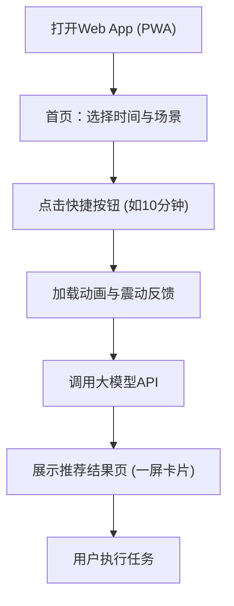

## 1. 产品概述
“AI时间规划局”是一款专为移动端打造的PWA（渐进式Web应用），旨在帮助用户在碎片化时间（如通勤、排队、休息）内快速获取高效的任务建议。
- 核心解决用户“有几分钟空闲但不知道干什么”的痛点，主打极简交互、快速响应和类似原生App的体验。
- 目标群体为希望充分利用碎片时间的年轻用户。

## 2. 核心功能

### 2.1 用户角色
| 角色 | 注册方式 | 核心权限 |
|------|----------|----------|
| 普通用户 | 免登录/本地存储 | 使用全部核心功能（选择时间、场景、获取推荐） |

### 2.2 功能模块
1. **首页（时间与场景选择）**：核心入口，大按钮一键选择可用时间和当前场景。
2. **推荐结果页**：卡片式展示AI推荐的任务、原因及执行步骤。
3. **任务管理页（次要）**：简单的任务历史或时间设置。

### 2.3 页面详情
| 页面名称 | 模块名称 | 功能描述 |
|----------|----------|----------|
| 首页 | 时间选择器 | 提供 5分钟、10分钟、15分钟、30分钟 四个快捷按钮 |
| | 场景识别器 | 提供 通勤、等人、休息 等快捷场景按钮，使AI推荐更精准 |
| | 触发反馈 | 点击按钮后，立即触发AI推荐，伴随轻微震动反馈（Haptic） |
| 推荐结果页 | 任务卡片 | 一屏展示推荐任务名称、推荐原因（时间短+高收益）、执行步骤（3步行动） |
| | 操作按钮 | 极简操作：如“完成”或“返回” |

## 3. 核心流程
用户打开应用后，直接在首页选择时间和场景，系统立即请求AI大模型并返回结构化的推荐卡片，用户看完即可行动。

## 4. 用户界面设计
### 4.1 设计风格
- **整体风格**：极简主义，移动优先，类似原生App。无复杂UI，去除多余装饰。
- **色彩规范**：深色模式（Background: #000000）为主，搭配高亮主题色（Theme: #00ff88 荧光绿）以突出核心按钮，科技感强。
- **按钮样式**：大面积、大圆角，提供清晰的点按反馈（缩放+震动）。
- **排版字体**：大字号，无衬线字体，确保在手机上“秒懂”。
- **动效反馈**：结果页渐入（Fade in / Slide up），点击按钮时的轻微缩放。

### 4.2 页面设计概览
| 页面名称 | 模块名称 | UI元素 |
|----------|----------|--------|
| 首页 | 头部引导 | "我现在有 ⏱" (大标题, 简洁) |
| | 时间网格 | 大按钮排布，背景深色，文字高亮主题色 |
| | 场景选择 | 底部胶囊按钮组 (通勤, 等人, 休息) |
| 推荐结果页 | 结果卡片 | 占据核心屏幕的独立卡片，包含Emoji图标，层次分明：🎯 任务, 📌 原因, 📋 步骤 |

### 4.3 响应式策略
- **移动端优先**：强制最大宽度（如 `max-w-md`）并水平居中显示。在PC端也保持手机尺寸的容器，确保核心场景体验不被打折。
- **触控优化**：所有交互元素（按钮、卡片）的最小点击区域充足，不让用户费力瞄准。
- **PWA配置**：通过 `manifest.json` 支持添加到手机桌面（Standalone模式），隐藏浏览器导航栏，实现“伪装成App”的效果。