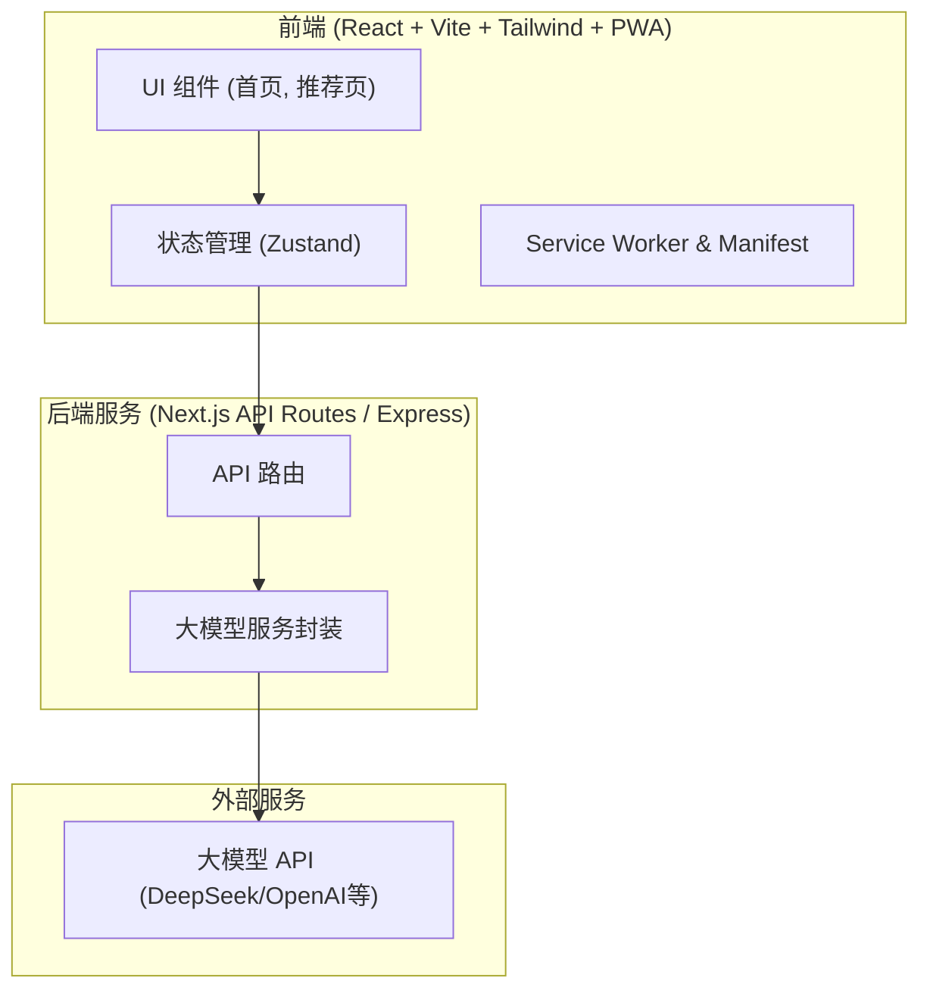

## 1. 架构设计


## 2. 技术说明
- **前端框架**：React@18 + Vite + TailwindCSS@3
- **动效库**：Framer Motion (用于页面加载、卡片渐入、点击缩放)
- **PWA 支持**：`vite-plugin-pwa` (生成 `manifest.json` 与 service worker，实现全屏和添加到桌面功能)
  - `name`: "AI Time Scheduler"
  - `short_name`: "Scheduler"
  - `display`: "standalone"
  - `background_color`: "#000000"
  - `theme_color`: "#00ff88"
- **震动反馈**：Web API `navigator.vibrate([15])` (轻微震动)
- **后端服务**：可采用全栈框架（如 Vite + React 搭配轻量后端或 serverless 函数，为简便可先在前端模拟请求，最终部署时加上真实的 Node API）。

## 3. 路由定义 (前端)
| 路由 | 描述 |
|------|---------|
| `/` | 首页：时间与场景选择，极简大按钮 |
| `/recommendation` | 推荐结果展示页：卡片式结果展示 |

## 4. API 定义
### 4.1 生成推荐任务
- **路径**: `POST /api/recommend`
- **请求体 (Request)**:
  ```typescript
  interface RecommendRequest {
    timeMinutes: number; // 例如：5, 10, 15, 30
    scene: string; // 例如："通勤", "等人", "休息"
  }
  ```
- **响应体 (Response)**:
  ```typescript
  interface RecommendResponse {
    taskName: string; // 推荐任务 (例如：背英语单词)
    reason: string; // 推荐原因 (例如：时间短 + 高收益)
    steps: string[]; // 执行步骤 (仅3步行动)
  }
  ```

## 5. 提示词工程 (Prompt Engineering)
为了保证 AI 逻辑的“移动化”和“秒懂”，后端调用大模型时的 System Prompt 必须严格限制输出格式：
- **要求**：不输出任何多余的解释，直接返回 JSON 格式。
- **内容**：针对 `{timeMinutes}` 分钟和 `{scene}` 场景，给出一个极简任务。必须包含 `taskName`, `reason`, `steps`（仅3步）。

## 6. 数据模型
本地优先 (Local First)，暂不需要复杂数据库。
- 使用 `localStorage` 缓存用户的场景选择偏好。
- 使用状态管理（Zustand 或 Context）在页面跳转时共享 `RecommendResponse` 数据。